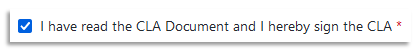
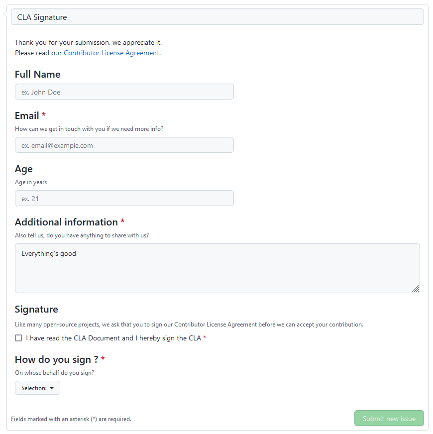

<p align="center">
  <a href="https://github.com/marketplace/actions/contributor-assistant">
    
  </a>
</p>

<h1 align="center">
  Signature Assistant Action ✍️
</h1>

<p align="center">
  <a href="https://github.com/cla-assistant/contributor-assistant/actions">
    
  </a>

  <a href="https://github.com/cla-assistant/contributor-assistant/releases">
    
  </a>
  
  <a href="https://github.com/marketplace/actions/contributor-assistant">
    
  </a>
</p>

<p align="center">
  This <a href="https://github.com/features/actions">GitHub Action</a> will automatically check for committer signatures when submitting a <a href="https://docs.github.com/en/github/collaborating-with-pull-requests">Pull Request</a>. It can be configured to use any document you'd like, including <b>CLA</b> and <b>DCO</b>. It can also handle cross repository signatures. <!-- and works with <a href="https://github.com/enterprise">GitHub Enterprise</a> too. -->
</p>

<p align="center">
  
</p>

- [Getting Started 🚀](#getting-started-)
  - [Workflow](#workflow)
  - [Signature form](#signature-form)
- [Use as a Deno Module 📦](#use-as-a-deno-module-)
- [Configuration 📁](#configuration-)
  - [Required Setup](#required-setup)
  - [Optional Setup](#optional-setup)
    - [Ignore list](#ignore-list)
  - [Custom Fields](#custom-fields)
  - [Config file](#config-file)
- [FAQ ❓](#faq-)
  - [What should my Contributor License Agreement say?](#what-should-my-contributor-license-agreement-say)
  - [I need to request more information from the signer](#i-need-to-request-more-information-from-the-signer)
  - [I have entered incorrect information when I signed / I need to update my signature](#i-have-entered-incorrect-information-when-i-signed--i-need-to-update-my-signature)
  - [My signature has not been taken into account](#my-signature-has-not-been-taken-into-account)
  - [How can I share signatures between several repositories ?](#how-can-i-share-signatures-between-several-repositories-)
  - [What happens if I change the form ?](#what-happens-if-i-change-the-form-)
  - [How do I migrate old signatures from the CLA Assistant Lite or the CLA Assistant Classic?](#how-do-i-migrate-old-signatures-from-the-cla-assistant-lite-or-the-cla-assistant-classic)
- [License 📜](#license-)
- [Credits](#credits)

## Getting Started 🚀

### Workflow

We recommend to create a dedicated workflow for this action. Indeed, there are many [events](https://help.github.com/en/articles/events-that-trigger-workflows) that trigger it and you should keep all of them.

Add the following file to your repository in the workflows directory, for example `.github/workflows/request-signatures.yml`

```yml
name: Contributor Assistant - Signature Assistant

on:
  issues: # Signature tracking
    types: [labeled] 
  issue_comment: # Re-trigger the action
    types: [created] 
  pull_request_target: # Pull Request updates
    types: [opened,synchronize,closed,reopened,labeled,unlabeled] 

jobs:
  signature_assistant:
    runs-on: ubuntu-latest
    steps:
      - name: Signature Assistant ✍️
        if : github.event.label.name == 'signature form' || github.event.comment.body == 'recheck' || github.event.issue.pull_request || github.event_name == 'pull_request_target' # various conditions to limit the triggering of the action
        uses: cla-assistant/contributor-assistant/actions/signatures@main
        env:
          GITHUB_TOKEN: ${{ secrets.GITHUB_TOKEN }}
          PERSONAL_ACCESS_TOKEN : ${{ secrets.PERSONAL_ACCESS_TOKEN }} # This token is required for consuming the Actions re-run API to automatically re-run the last failed workflow and also for storing the signatures in a remote repository if required. More details in the configuration section.
        with:
          form-path: 'signature-form.yml' # The document committers will see when they sign (required)
          ignore-list: '@MAINTAINER'
```

If you would like to change the triggering conditions, please refer to the [configuration section](#configuration-).

It's recommended that you use [Dependabot](https://dependabot.com/github-actions/) to keep your workflow up-to-date. You can find the latest tagged version on the [GitHub Marketplace](https://github.com/marketplace/actions/contributor-assistant) or on the [releases page](https://github.com/cla-assistant/contributor-assistant/releases).

### Signature form

If you do not add a form to your repository, a new one will be generated automatically from a [template](./examples/template.yml). But it is advisable to create one manually, because you will probably want to [modify it]() to suit your needs.

```yml
name: Contributor Document
description: Sign the Contributor Document
title: "Document Signature"
labels: ["signature form"]
body:
- type: markdown
  attributes:
    value: |
      # Contributor Document

      This document defines the basics on how people can cooperate with me in general.

      ## Open Source

      I'm a fan of Open Source Software as it accelerates the overall progress in my opinion.  
      If you contribute to one of my repositories this means that you do not have any monetary / licensing or whatever claims out of those contributions. 
      I claim the right to use whatever license I want for my repositories (e.g. GNU AGPL...).

      ## Freedom

      I claim the right to change my repositories in whatever way I like as time goes by. If a contributor wants to develop things into a different direction than I, the corresponding contributor can do this in his own repository. 

      ## Fairness

      Each contributor should have the best of intentions when it comes to fairness and mutual support.
- type: checkboxes
  id: signature # required
  attributes:
    label: Signature
    options:
    - label: I have read the Contributor Document and I hereby sign this document.
      required: true
  validations:
    required: true
```

❗ [Creating a label](https://docs.github.com/en/issues/using-labels-and-milestones-to-track-work/managing-labels#creating-a-label) for this form is also very important. It will be used to detect new signatures, by default this label is `signature form`. You can change it in the inputs.

## Use as a Deno Module 📦

If you'd like to use the functionality provided by this action in your own action you can import it from github.

```ts
import signatureCheck from "https://raw.githubusercontent.com/cla-assistant/contributor-assistant/main/src/signature-functions/mod.ts";
// Or
import signatureCheck from "https://denopkg.com/cla-assistant/contributor-assistant/src/signature-functions/mod.ts";
```

Calling the functions directly will require you to pass in an object containing the variables found in the configuration section.

```ts
await signatureCheck({
  storage: {
    form: "signature-form.yml",
  },
  ignoreList: ["user1"],
  labels: {
    form: "signature form",
  },
});
```

For more information regarding the [action interface please click here](https://github.com/cla-assistant/contributor-assistant/blob/main/src/signature-functions/options.ts).

## Configuration 📁

The `with` portion of the workflow **must** be configured before the action will work. You can add these in the `with` section found in the examples above. Any `secrets` must be referenced using the bracket syntax and stored in the GitHub repository's `Settings/Secrets` menu. You can learn more about setting environment variables with GitHub actions [here](https://help.github.com/en/actions/configuring-and-managing-workflows/creating-and-storing-encrypted-secrets#creating-encrypted-secrets).

### Required Setup

The following options must be configured in order to check for signatures.

| Key                     | Value Information                                                                                                                                                                                                                                                                                                                                                                       | Type            |
| ----------------------- | --------------------------------------------------------------------------------------------------------------------------------------------------------------------------------------------------------------------------------------------------------------------------------------------------------------------------------------------------------------------------------------- | --------------- |
| `GITHUB_TOKEN`          | GitHub automatically creates a GITHUB_TOKEN secret to use in your workflow. Paste it by using the standard syntax for referencing secrets: `${{ secrets.GITHUB_TOKEN }}`.                                                                                                                                                                                                               | `env` or `with` |
| `PERSONAL_ACCESS_TOKEN` | A token you have generated that will be used to access the GitHub API (re-run endpoint and remote repositories). You have to [create it with repo scope](https://github.com/settings/tokens/new) and store it in the repository's secrets with the name `PERSONAL_ACCESS_TOKEN`. Paste it by using the standard syntax for referencing secrets: `${{ secrets.PERSONAL_ACCESS_TOKEN }}`. | `env` or `with` |
| `form-path`             | The document which shall be signed by the contributor(s). Must be an [issue form](#custom-fields) (yml file)                                                                                                                                                                                                                                                                            | `with`          |

### Optional Setup

All of these parameters go into the `with` part.

| Key                              | Value Information                                                                                                                                                                     | Default value                                                                                                                                                                           |
| -------------------------------- | ------------------------------------------------------------------------------------------------------------------------------------------------------------------------------------- | --------------------------------------------------------------------------------------------------------------------------------------------------------------------------------------- |
| `signature-path`                 | The path where the signatures will be stored.                                                                                                                                         | `".github/contributor-assistant/signatures.json"`                                                                                                                                       |
| `signature-branch`               | The branch where the signatures will be stored.                                                                                                                                       | *default branch*                                                                                                                                                                        |
| `signature-remote-repo`          | The name of another repository to store the signatures.                                                                                                                               | *none*                                                                                                                                                                                  |
| `signature-remote-owner`         | The owner of the remote repository, can be an organization. Leave empty to default to this repository owner.                                                                          | *none*                                                                                                                                                                                  |
| `re-run-path`                    | The path where the re-run cache will be stored.                                                                                                                                       | `".github/contributor-assistant/signatures-re-run.json"`                                                                                                                                |
| `re-run-branch`                  | The branch where the re-run cache will be stored.                                                                                                                                     | *default branch*                                                                                                                                                                        |
| `ignore-list`                    | A list of users that will be ignored when checking for signatures, more details [below](#ignore-list). **Bots** are ignored by default.                                               | `""`                                                                                                                                                                                    |
| `prevent-signature-invalidation` | Prevent signature invalidation if the form has been modified. Signatures will still be marked as invalidated in the signature file but committers won't need to re-sign the document. | `false`                                                                                                                                                                                 |
| `re-trigger`                     | The keyword to re-trigger signature checks.                                                                                                                                           | `"recheck"`                                                                                                                                                                             |
| `all-signed-comment`             | The posted comment when each committer has signed the document.                                                                                                                       | `"All contributors have signed the CLA  ✍️ ✅"`                                                                                                                                           |
| `comment-header`                 | Usually a message thanking the committers and asking them to sign the document.                                                                                                       | `"Thank you for your submission, we appreciate it. Like many open-source projects, we ask that you sign our **Contributor License Agreement** before we can accept your contribution."` |
| `signed-label`                   | A label that will be applied once all committers have signed the document                                                                                                             | *none*                                                                                                                                                                                  |
| `unsigned-label`                 | A label that will be applied until all committers have signed the document                                                                                                            | *none*                                                                                                                                                                                  |
| `ignore-label`                   | Add this label to skip the signature checks.                                                                                                                                          | *none*                                                                                                                                                                                  |
| `form-label`                     | The label used to find the document form.                                                                                                                                             | `"signature form"`                                                                                                                                                                      |

#### Ignore list

The ignore list allows you to exclude by default certain users, a particular role or an expression in the name of the committers.
The separator between the patterns is a comma.

| Pattern            | Syntax   | Information                                                                                                                           |
| ------------------ | -------- | ------------------------------------------------------------------------------------------------------------------------------------- |
| Text               | `text`   | Will be compared strictly with user logins or with unknown user names.                                                                |
| Regular Expression | `/text/` | Any valid ECMAScript regex. Unlike text patterns, the pattern here is tested regardless of its position in the user's login.          |
| Access Level       | `@text`  | One of the following levels: `ADMIN`, `MAINTAINER`, or `CONTRIBUTOR`. Maintainer includes admin, and contributor includes maintainer. |

**Bots** are ignored by default.

**Example**

```ts
"user1, @MAINTAINER, user3, /^test.*/"
```

### Custom Fields

<p align="center">
  
</p>

If you need to collect detailed information about your contributors you can add so called "custom fields" to your form. You can use any input type defined by [GitHub's form schema](https://docs.github.com/en/communities/using-templates-to-encourage-useful-issues-and-pull-requests/syntax-for-githubs-form-schema): markdown, textarea, input, dropdown, checkboxes.

```yml
name: Contributor License Agreement
description: Sign the Contributor License Agreement
title: "CLA Signature"
labels: ["signature form"]
body:
- type: markdown
  attributes:
    value: |
      Thank you for your submission, we appreciate it.
      Please read our [Contributor License Agreement](https://github.com/cla-assistant/github-action/blob/master/SAPCLA.md).
- type: input
  id: name
  attributes:
    label: Full Name
    placeholder: ex. John Doe
  validations:
    required: false
- type: input
  id: email
  attributes:
    label: Email
    description: How can we get in touch with you if we need more info?
    placeholder: ex. email@example.com
  validations:
    required: true
- type: input
  attributes:
    label: Age
    description: Age in years
    placeholder: "ex. 21"
  validations:
    required: false
- type: textarea
  attributes:
    label: Additional information
    description: Also tell us, do you have anything to share with us?
    placeholder: I love open-source software
    value: "Everything's good"
  validations:
    required: true
- type: checkboxes
  id: signature # required
  attributes:
    label: Signature
    description: Like many open-source projects, we ask that you to sign our Contributor License Agreement before we can accept your contribution.
    options:
    - label: I have read the CLA Document and I hereby sign the CLA
      required: true
- type: dropdown
  attributes:
    label: How do you sign ?
    description: On whose behalf do you sign?
    options:
    - I am signing on behalf of myself.
    - I am signing on behalf of my employer.
  validations:
    required: true
```

The `signature` id field is mandatory in order to validate the signature. Currently only the `checkbox` type is supported, with a single box.

```yml
- type: checkboxes
  id: signature # required
  attributes:
    label: Signature
    options:
    - label: I have read the Contributor Document and I hereby sign this document.
      required: true
```

You can also define which of required information can be taken from user's GitHub account. In that case Signature Assistant pre-fills the form with GitHub data (**Note**: only works with generated links in a PR). The possible values for the `id` fields can be found in the [GitHub-Api description](https://github.com/github/rest-api-description/blob/main/descriptions/api.github.com/api.github.com.json) (`"public-user" key`).

Example:

```yml
- type: input
  id: email # Automatically pre-fills with user's email
  attributes:
    label: Email
    description: How can we get in touch with you if we need more info?
    placeholder: ex. email@example.com
  validations:
    required: true
```

### Config file

If you need more control over the behavior of the action, you can define all the above options and some other options in a yaml file. You can find the options interface [here](../../src/signature-functions/options.ts).

This can also be useful if you want to share the configuration of the action over several depots, to support corporate-level contributors for example.

There are additional parameters to specify where your configuration file is located.

| Key                   | Value Information                                                                                            | Default value    |
| --------------------- | ------------------------------------------------------------------------------------------------------------ | ---------------- |
| `config-path`         | The path of the config file.                                                                                 | *none*           |
| `config-branch`       | The branch of the config file.                                                                               | *default branch* |
| `config-remote-repo`  | The name of another repository to fetch the config file from.                                                | *none*           |
| `config-remote-owner` | The owner of the remote repository, can be an organization. Leave empty to default to this repository owner. | *none*           |

**Example**

```yml
name: Contributor Assistant - Signature Assistant
# [...]
        uses: cla-assistant/contributor-assistant/actions/signatures@main
        env:
          GITHUB_TOKEN: ${{ secrets.GITHUB_TOKEN }}
          PERSONAL_ACCESS_TOKEN : ${{ secrets.PERSONAL_ACCESS_TOKEN }}
        with:
          config-path: ".github/contributor-assistant/config.yml"
```

```yml
# .github/contributor-assistant/config.yml
type: contributor-assistant/signatures/config
version: 1
data:
  storage:
    form: signature-form.yml # required
    signatures:
      type: "local"
      branch: "cla"
      path: "signatures.yml"
  comment:
    summary: |
      **${signed}** out of **${total}** committers have signed the document.
  ignoreList: ["@CONTRIBUTOR", "user1"]
```

You can also create a global configuration file covering all the services of the contributor assistant.

```yml
type: contributor-assistant/config
version: 1
data:
  - type: contributor-assistant/signatures/config
    version: 1
    data:
      storage:
        form: signature-form.yml
```

## FAQ ❓

### What should my Contributor License Agreement say?

We're no lawyers, but we can suggest using http://contributoragreements.org/ for a fill-in-the-blank approach to creating a CLA tailored to your needs.

### I need to request more information from the signer

You can [add more fields in your form](#custom-fields).

### I have entered incorrect information when I signed / I need to update my signature

You just have to re-sign by opening a new issue. Your old signature will be preserved, as it is still associated with your previous contributions. The new signature is now valid.

### My signature has not been taken into account

It is likely that you signed at the same time as someone else, and a conflict may have arisen. In this case, comment `recheck` in the Pull Request or the related issue. If that doesn't solve the problem, please report the issue.

### How can I share signatures between several repositories ?

Using the inputs `signature-remote-repo` and `signature-remote-owner`, you can choose where to store your signatures. If several repositories point to the same file then their signatures will be shared.

### What happens if I change the form ?

By default the signatures are invalidated. If this is not the behavior you are looking for, you can set `prevent-signature-invalidation` to `true`.

### How do I migrate old signatures from the CLA Assistant Lite or the CLA Assistant Classic?

ℹ [CLA Assistant Lite repository](https://github.com/cla-assistant/github-action), [CLA Assistant Classic repository](https://github.com/cla-assistant/cla-assistant)

The easiest way is to go to the [migration web interface](https://cla-assistant.github.io/contributor-assistant/) and upload your signatures.

We also provide you with [scripts](../../src/signature-functions/compatibility) to convert signatures into the new format.

<!-- ### How can I contribute?

You want to contribute to Contributor Assistant? Welcome! Please read [here](./CONTRIBUTING.md). -->

## License 📜

Contributor License Agreement assistant

Copyright (c) 2021 [SAP SE](http://www.sap.com) or an SAP affiliate company. All rights reserved.

Licensed under the Apache License, Version 2.0 (the "License");
you may not use this file except in compliance with the License.
You may obtain a copy of the License at

    http://www.apache.org/licenses/LICENSE-2.0

Unless required by applicable law or agreed to in writing, software
distributed under the License is distributed on an "AS IS" BASIS,
WITHOUT WARRANTIES OR CONDITIONS OF ANY KIND, either express or implied.
See the License for the specific language governing permissions and
limitations under the License.

## Credits

<p align="center">
    
</p>
